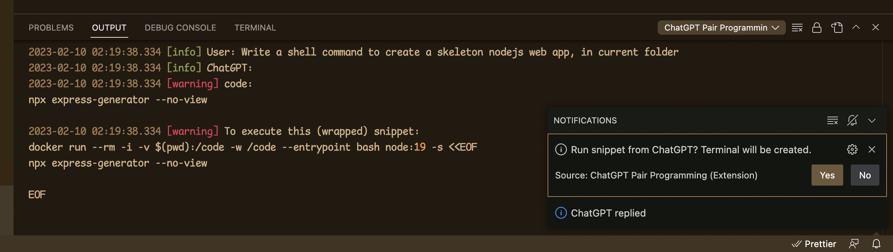
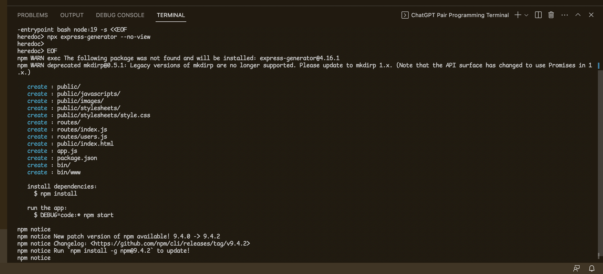

# ChatGPT Pair Programming

VS Code extension for Pair Programming with ChatGPT

## Features

Ask ChatGPT to write something and run his code in Docker.

For example: _Write a shell command to create a skeleton nodejs web app, in current folder_:

## Extension Settings

This extension contributes the following settings:

- `chatgpt-pair-programming.apiKey`: OpenAI API key from [https://platform.openai.com/account/api-keys](https://platform.openai.com/account/api-keys).
- `chatgpt-pair-programming.wrappingTemplate`: Code to wrap snippets from ChatGPT, `docker run ...` by default.
- `chatgpt-pair-programming.askBeforeEachRun`: Set to `false` to stop asking before running ChatGPT snippets.

## Release Notes

### 0.0.1

Initial release. Supporting simple use case.

<!--
## Following extension guidelines

Ensure that you've read through the extensions guidelines and follow the best practices for creating your extension.

- [Extension Guidelines](https://code.visualstudio.com/api/references/extension-guidelines)

## Working with Markdown

You can author your README using Visual Studio Code. Here are some useful editor keyboard shortcuts:

- Split the editor (`Cmd+\` on macOS or `Ctrl+\` on Windows and Linux).
- Toggle preview (`Shift+Cmd+V` on macOS or `Shift+Ctrl+V` on Windows and Linux).
- Press `Ctrl+Space` (Windows, Linux, macOS) to see a list of Markdown snippets.

## For more information

- [Visual Studio Code's Markdown Support](http://code.visualstudio.com/docs/languages/markdown)
- [Markdown Syntax Reference](https://help.github.com/articles/markdown-basics/)

**Enjoy!**

-->

